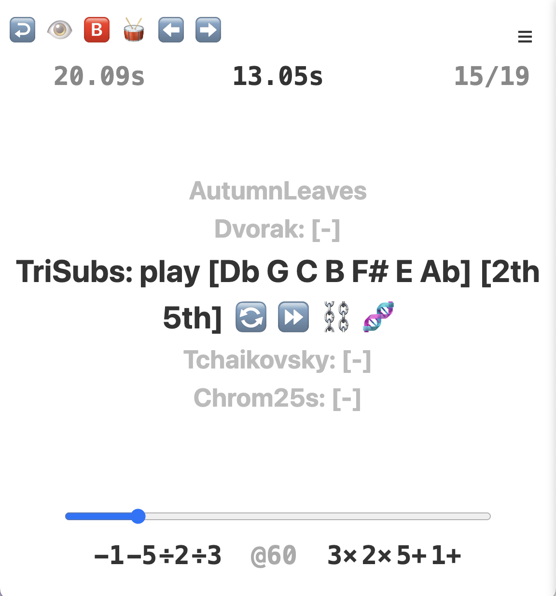

# Prfl

A musical practice list generator with a timer and metronome built in.

## Why

Practicing well means controlling *what* you practice (randomized vs. blocked
repetition) and *when* you come back to it (spaced repetition — tracking which
items you've reviewed and which you haven't).

Controlling what you practice works better, if you do it in written form, separately and up-front,
reducing the amount of context switching required in practice.

Having a programmable practice list helps maintain priorities, because they're easier to asses when you see them on paper.
On top of that, it allows traversing any musical text in a non-linear fashion without the overhead of keeping a pen and paper index of the visited spots.

Randomized practice in this way is likely to improve the quality of preparing new material,
because encountering new problems in different orders brings new insights and prevents plateaus.

This project unifies following such a practice list with the timers and computed parameters,
so you're not juggling a metronome app, a timer, and a notes file separately.

## Inspiration

- Richard A. Schmidt, Timothy D. Lee, Carolyn Winstein, Gabriele Wulf, Howard Zelaznik — *Motor Learning and Performance: From Principles to Application*, 3rd edition
- Molly Gebrian — *Learn Faster, Perform Better*

## Screenshot



# ToneLib API

[`src/lib/ToneLib.ts`](src/lib/ToneLib.ts) is a music-theory core: note parsing/rendering, intervals, and
major-key generation via the circle of fifths. It underpins `ToneLibViolin.ts`
(fingerboard positions) and `ToneLibFlashcards.ts` (quiz generation).

## Types

```ts
type Name = 'c' | 'd' | 'e' | 'f' | 'g' | 'a' | 'b'

interface Note {
  name: Name
  alter: number   // accidental: -2 (bb) .. 2 (##), 0 = natural
  octave: number
}

type Key = Note[]   // seven notes, one per letter name, in scale order
```

`names: Name[]` — `['c', 'd', 'e', 'f', 'g', 'a', 'b']`, the canonical letter order.

## Notes

- **`parseNote(note: string): Note | null`** — parses strings like `"c"`, `"f#"`,
  `"bb3"` (letter + up to two accidentals `#`/`b` + optional octave, default octave 4).
  Returns `null` if it doesn't match.
- **`equalNote(a: Note, b: Note): boolean`** — true if same letter name and same alter
  (octave is ignored).
- **`rename(a: Note, k: Key): Note`** — respells a note's accidental to match its
  letter's spelling in key `k`.
- **`semi(n: Note): number`** — absolute semitone number (chromatic pitch), used for
  comparing/sorting/measuring distance between notes.
- **`render(n: Note, octave: boolean = true): string`** — human string form, e.g.
  `"F#4"`; pass `false` to omit the octave (`"F#"`).
- **`addAccidental(note: Note, accidental: number): Note`** — adds `accidental` to
  `alter` (e.g. `+1` sharpens, `-1` flattens).
- **`enharmonics(semiTarget: number): Note[]`** — all spelled notes (across all major
  keys) sharing the same pitch class as `semiTarget`, placed in the correct octave.
- **`rebase(note: Note, base: Note): Note`** — keeps `note`'s letter/alter but sets its
  octave relative to `base`'s octave, choosing the octave so `note` sits just at/above
  `base` (used to normalize notes into a consistent octave frame).
- **`normalize(n: Note): Note`** — `rebase(n, c4)`, i.e. rebase relative to middle C.
- **`rebaseSemi(note: Note, semiBase: number): Note`** — rebase `note` against whichever
  enharmonic spelling corresponds to `semiBase`.
- **`stepTo(n: Note, to: Note): Note`** *(internal, not exported — see `stepUp`/`stepDown`)*
  steps `n` one letter name toward `to`, carrying `to`'s accidental if it arrives.
- **`addInterval(note: Note, interval: number): Note`** — steps `note` by `interval`
  letter-name steps (positive = up, negative = down; e.g. `+2` = third above). Interval
  is in scale steps, not semitones. No-ops if `interval` is `0` or `>200` in magnitude.

## Note collections

- **`allNotes(): Note[]`** — every note (all letters × all accidentals) across all
  major keys, unfiltered/undeduplicated by pitch.
- **`normalizedNotesRendered(k: Note[]): Set<string>`** *(immutable `Set`)* — renders
  each note in `k` normalized to octave-less strings, e.g. `{"C", "D#", ...}`.
- **`allNotesRendered(): Set<string>`** — `normalizedNotesRendered` over every note in
  every major key; the universe of all possible note spellings.

## Intervals

- **`nameInterval(int: number): string`** — names an interval by scale-step distance
  mod 7: `unison`, `second`, `third`, `fourth`, `fifth`, `sixth`, `seventh`. Sign is
  ignored (mod is applied to `Math.abs(int)`).
- **`pointwiseInterval(a: Note, b: Note, ...cs: Note[]): Note[]`** — the stepwise
  (letter-by-letter) path from `a` to `b` (and on through any further notes in `cs`),
  inclusive of endpoints. E.g. useful for spelling out a scalar run between two notes.

## Keys

- **`major(): Key`** — the key of C major: `[C, D, E, F, G, A, B]`.
- **`keysMajor(): Key[]`** — all 15 major keys reachable within 7 steps around the
  circle of fifths (7 sharp keys, 7 flat keys, plus C), each rebased to a consistent
  octave.
- **`findMajor(tonic: Note): Key | undefined`** — the key in `keysMajor()` whose tonic
  matches `tonic` (by letter+accidental, ignoring octave).
- **`majorKey(note: Note): Key | undefined`** — like `findMajor`, but matches by
  rendered tonic name (octave-less), so `note`'s octave doesn't need to line up first.
- **`keyCenters(mode: number = 0): Note[]`** — the tonics of all major keys, sorted by
  pitch; `mode` selects which scale degree to report instead of the tonic (e.g.
  `mode=1` gives each key's second degree).
- **`keySemis(mode: number = 0): number[]`** — `keyCenters(mode)` mapped through
  `semi(normalize(...))`; the semitone (0–11-ish) for each key center.
- **`keysBySemi(n: number): Note[]`** — all key-center notes (tonics) that are
  enharmonically equivalent to pitch class `n`.
- **`findCommonKey(a: number, b: number): [Key, [Note, Note]] | undefined`** — finds a
  major key containing notes matching both semitone classes `a` and `b`; returns the
  key plus the two matching notes. Logs and returns `undefined` if none exists.
- **`nameLeadingDim7(): string[]`** — for each key's dominant-flat-9 chord, renders the
  3rd/5th/7th/9th degrees space-joined (leading-tone diminished-seventh spellings).
- **`majorKeyCentersPerLetter(): Note[][]`** — all 15 key tonics, normalized, grouped by
  letter name (`C D E F G A B` order), each group sorted by accidental.
- **`majorKeyCentersWeighted(): [Note, ...[Note[], number][]][]`** — per letter, the
  natural tonic plus its accidental variants chunked by `|alter|` and paired with a
  weight (`1 / number of chunks`) — used to weight enharmonic groups evenly regardless
  of how many spellings exist.
- **`keyChunkWeights(notes: Note[], weight: number): [Note, number][]`** — splits
  `weight` evenly across `notes`.
- **`majorKeyCentersWeights(): [Note, number][]`** — flattens
  `majorKeyCentersWeighted()` into a flat list of `(note, weight)` pairs summing to 7
  (one per letter) — a weighted sampling table over all key tonics, useful for
  randomized quiz generation that shouldn't over-represent keys with many enharmonic
  spellings.

## Quiz helpers

- **`notesMissing(k: Key, l: Key): Set<string>`** — note names (octave-less) present in
  neither key `k` nor key `l`, out of the full universe (`allNotesRendered()`).

## Consumers

- **`ToneLibViolin.ts`** — builds violin fingerboard positions per string (`G3 D4 A4
  E5`) using `enharmonics`, `semi`, `rename`, `majorKey`.
- **`ToneLibFlashcards.ts`** — generates flashcard Q/A pairs (intervals, scale degrees,
  neighbor tones, fingerboard positions) using `addInterval`, `nameInterval`,
  `majorKey`, `render`.
