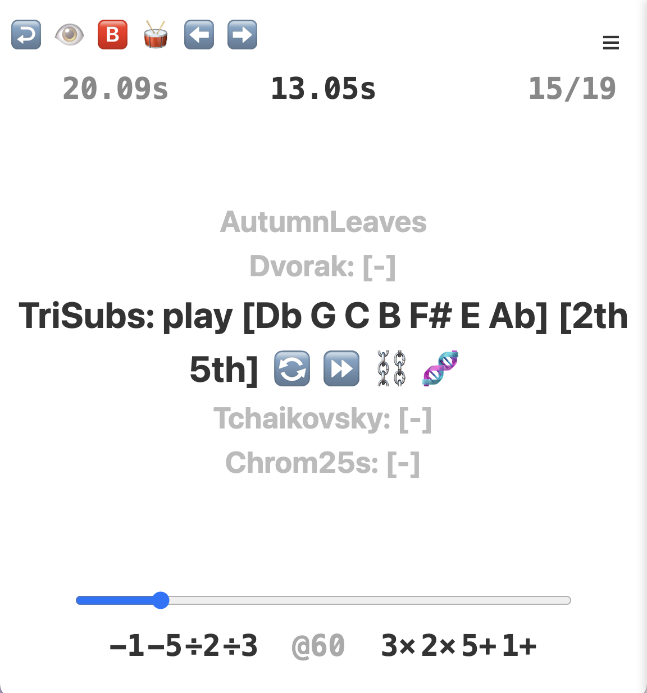

# Prfl

A musical practice list generator with a timer and metronome built in.

Offers hierarchical timers for items and their subdecks (parametrizations or real subdecks). Current item's timers can be also restarted or subtracted from the total.

## Why

Practicing well means controlling *what* you practice (randomized vs. blocked
repetition) and *when* you come back to it (spaced repetition — tracking which
items you've reviewed and which you haven't).

Controlling what you practice works better, if you do it in written form, separately and up-front,
reducing the amount of context switching required in practice.

Having a programmable practice list helps maintain priorities, because they're easier to asses when you see them on paper.
On top of that, it allows traversing any musical text in a non-linear fashion without the overhead of keeping a pen and paper index of the visited spots.

Randomized practice in this way is likely to improve the quality of preparing new material,
because encountering new problems in different orders brings new insights and prevents plateaus.

This project unifies following such a practice list with the timers and computed parameters,
so you're not juggling a metronome app, a timer, and a notes file separately.

## Inspiration

- Richard A. Schmidt, Timothy D. Lee, Carolyn Winstein, Gabriele Wulf, Howard Zelaznik — *Motor Learning and Performance: From Principles to Application*, 3rd edition
- Molly Gebrian — *Learn Faster, Perform Better*

## Screenshot

## Further LLM generated documentation

- [ToneLib API](ToneLib.md) — the music-theory core: notes, keys, intervals, transposition.
- [Randomize](Randomize.md) — the practice-list program: the `.rndl` language, timers, reviewing, tags, and the `next` programme.
